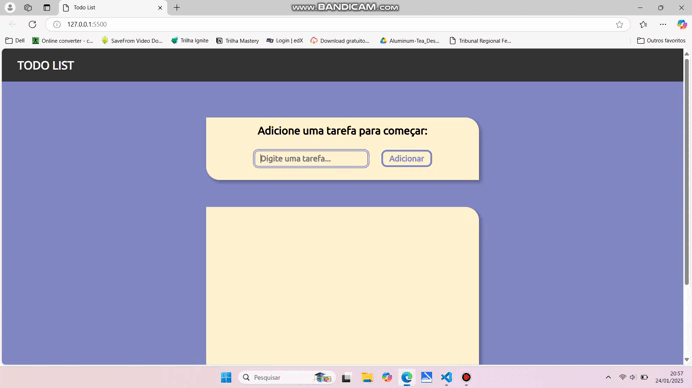

# Todo List

* Basicamente, essa Todo List foi desenvolvida com base em um vídeo de um canal, onde o desenvolvedor ensina como fazer uma todo list, entendi como funciona e adaptei para a minha necessidade.

* Acesso ao canal: <a href="https://youtube.com/@tylerpotts?si=ZZDtmUoRKiJeZdZc" target="_blank" rel="noopener noreferrer">Tyler Potts</a>

### Sobre:

* Essa todo list, foi desenvolvida com as seguintes funcionalidades: criar, editar e deletar uma tarefa de cada vez.

* Implementei algumas verificações, para evitar que tarefas vázias sejam criadas, e o mesmo vale para a edição de cada tarefa.

* E por fim, todo o estilo da página, eu desenvolvi com Sass e HTML5. E as funcionalidades com Javascript.

* Observação: Escolhi o Sass no lugar do Css para estilização deste projeto, para praticar os meus estudos em relação ao framework CSS: Sass.

* E também utilizei a extensão do Visual Studio Code chamada: Live Sass Compiler. Essa extensão serve para compilar o sass e converter todos os códigos de todos os arquivos Sass para código CSS. E assim, poder importar este arquivo CSS no index.html.

 

### Mobile:

### Tablet:

### Desktop:

 

* <a href="https://joao3872.github.io/Todo-List/" target="_blank" rel="noopener noreferrer">Acessar a Página</a>
